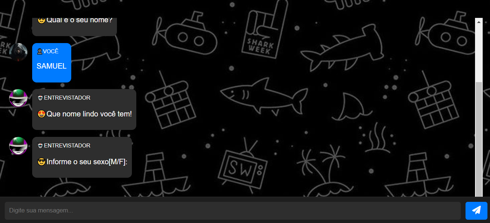
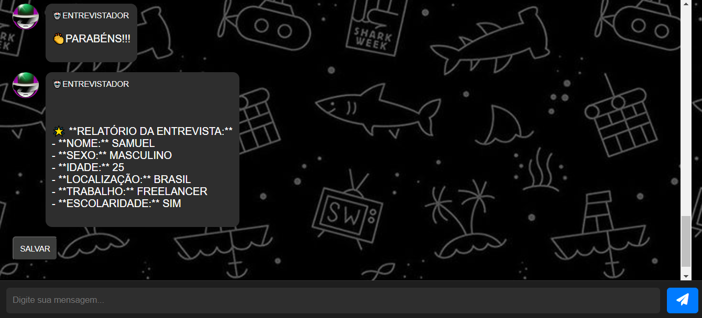
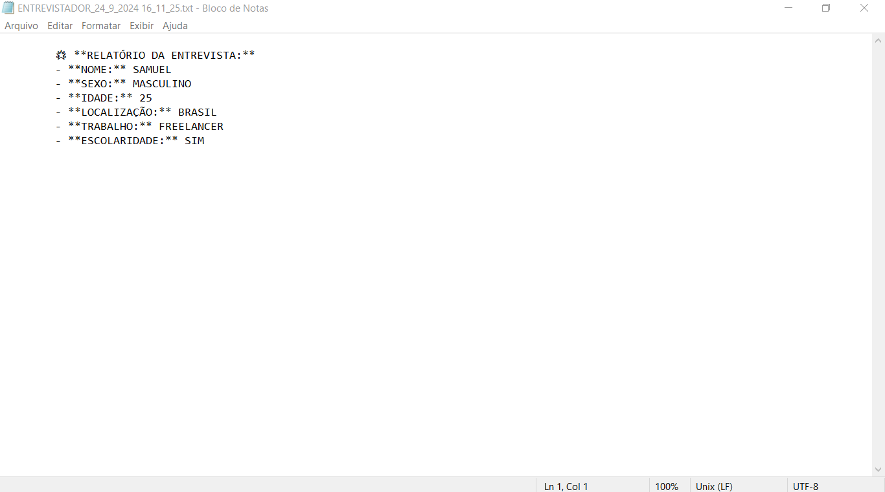

# ENTREVISTADOR COM WEBBOT
👨‍🏫O BOT ENTREVISTADOR SIMULA ENTREVISTAS DE FORMA INTERATIVA, OFERECE FEEDBACK E PERMITE O DOWNLOAD DE UM RELATÓRIO COM AS RESPOSTAS.

  
  
  

## DESCRIÇÃO:
O **Bot Entrevistador** é uma aplicação interativa projetada para simular uma entrevista. Ele faz uma série de perguntas ao usuário e fornece comentários personalizados com base nas respostas. Ao final da entrevista, o bot gera um relatório com as informações coletadas, que pode ser baixado como um arquivo de texto. Este bot pode ser utilizado para fins educacionais, de prática ou para entender melhor como funcionam entrevistas.

## FUNCIONALIDADES:
1. **Interação Conversacional:**
   - O bot inicia uma conversa amigável e faz perguntas sequenciais ao usuário.

2. **Comentários Personalizados:**
   - Após cada resposta do usuário, o bot fornece comentários personalizados com base nas respostas, utilizando condições lógicas para determinar as mensagens apropriadas.

3. **Relatório da Entrevista:**
   - Ao final da entrevista, o bot compila todas as informações em um relatório formatado, apresentando as respostas de forma clara e organizada.

4. **Download do Relatório:**
   - O usuário pode baixar o relatório como um arquivo de texto (`.txt`) com um nome que inclui a data e a hora da entrevista.

## EXECUTANDO O PROJETO:
1. **Início da Conversa:**
   - Abra o arquivo `./CODIGO/index.html` no navegador de sua preferencia.
   - Quando o bot é iniciado, ele cumprimenta o usuário e informa que começará a entrevista.

2. **Responda às Perguntas:**
   - O bot fará uma série de perguntas, incluindo:
     - Seu nome.
     - Seu sexo.
     - Sua idade.
     - Sua localização.
     - Seu trabalho.
     - Sua escolaridade.
   - O usuário deve responder a cada pergunta digitando sua resposta e pressionando "Enviar" ou a tecla "Enter".

3. **Receba Comentários:**
   - Após cada resposta, o bot fornecerá um comentário com base na resposta dada. O usuário verá um breve intervalo antes da próxima pergunta.

4. **Visualize o Relatório:**
   - Após a última pergunta, o bot apresentará um relatório formatado com todas as informações fornecidas.

5. **Baixe o Relatório:**
   - Clique no botão "SALVAR" abaixo do relatório para baixar o arquivo `ENTREVISTADOR_data_e_hora_atual.txt`, que conterá as respostas e os comentários do bot.

## EXEMPLO DE USO:
- **Usuário**: "Meu nome é Lucas."
- **Bot**: "😍Que nome lindo você tem!"
- **Usuário**: "M"
- **Bot**: "🌝Isso significa que você é HOMEM!!!"
- **Usuário**: "25"
- **Bot**: "😱Nossa, como você é jovem!!!"
- **Usuário**: "São Paulo"
- **Bot**: "🌎Excelente!!!"
- **Usuário**: "Desenvolvedor"
- **Bot**: "🙌Que bom!!!"
- **Usuário**: "Sim"
- **Bot**: "👏PARABÉNS!!!"
- **Bot**: "🌟 **RELATÓRIO DA ENTREVISTA:** ..."
- **Bot**: (Abaixo do relatório) "Clique em SALVAR para baixar o relatório."

## NÃO SABE?
- Entendemos que para manipular arquivos em `HTML`, `CSS` e outras linguagens relacionadas, é necessário possuir conhecimento nessas áreas. Para auxiliar nesse aprendizado, oferecemos cursos gratuitos disponíveis:
* [CURSO DE HTML E CSS](https://github.com/VILHALVA/CURSO-DE-HTML-E-CSS)
* [CURSO DE JAVASCRIPT](https://github.com/VILHALVA/CURSO-DE-JAVASCRIPT)
* [CURSO DE JQUERY](https://github.com/VILHALVA/CURSO-DE-JQUERY)
* [CONFIRA MAIS CURSOS](https://github.com/VILHALVA?tab=repositories&q=+topic:CURSO)

## CREDITOS:
- [INTERFACE FOI BASEADO NO "CONVERSADOR NA WEB"](https://github.com/VILHALVA/CONVERSADOR-NA-WEB)
- [AS PERGUNTAS FORAM BASEADAS NO "ENTREVISTA.py" DA VERSÃO 2.5 DO GNOSES](https://github.com/VILHALVA/GNOSES)
- [PROJETO FEITO PELO VILHALVA](https://github.com/VILHALVA)